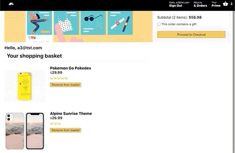

# caseIt

## Content Page
  * [Description](#description)
  * [Features](#features)
  * [Achievement](#achievement)
  * [Technologies](#technologies)

### Description

caseIt is a one stop gallery and ecommerce platform for iPhone cases. 

Visit [caseIt](https://ecomm-23f2e.web.app) to find out more!

---

### Features

1. User sign up/ sign in (Auth)
2. One click add to basket / remove from basket (Using Redux)
3. Redux state persist using redux-persist
4. Live search using Fuse.js
5. Payment enabled using Stripe.js API
6. Database storage of user's order history using Firebase Functions
7. Mobile Responsive 

#### App Demo:

---

### Motivation

As someone who always looks for mobile phone cases with unique and cool design, I wanted to create an ecommerce platform where I can see all available designs for sale, search for it easily using keywords and last but not least the purchasing process should be seamless. 

Next, I also got to experience the process of building an ecommerce platform from scratch albeit it being a simple one. I also got to ponder upon issues such as the edge cases to be considered, the technical difficulties and also how best to make my platform as appealing to other users as possible. 

---

### Technologies

##### ReactJS/Redux

1. React Routers for accessing different pages, i.e. signin/signout page, home page, payment page, checkout page etc.  
2. React Hooks
3. Redux for state management and creating actions such as adding item to basket, removing item from basket, clearing basket

##### Firebase / NodeJS/ Express

1. Firebase for authentication
2. Firestore for items database storage
3. Firebase functions with NodeJS/Express to store user's order history in Firestore. 

##### Misc.

1. Fuse.js (Live keyword search feature)
2. Stripe.js (enable payment for products in basket)
3. Mobile Responsiveness using CSS media queries

---

